# UAMS - Visual Architecture Diagrams

This document contains visual diagrams for the User Access Management System architecture, workflows, and data flows.

## 1. System Architecture Overview

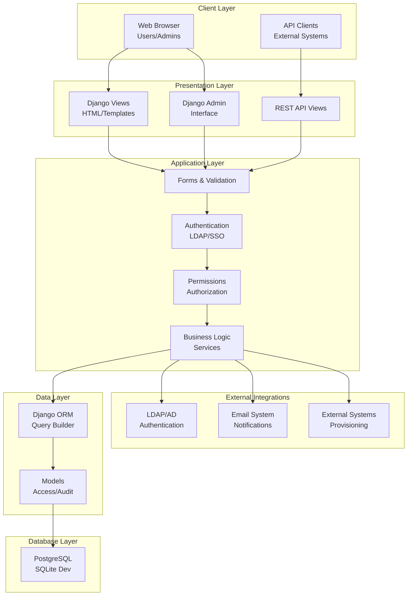

## 2. Application Modules & Dependencies

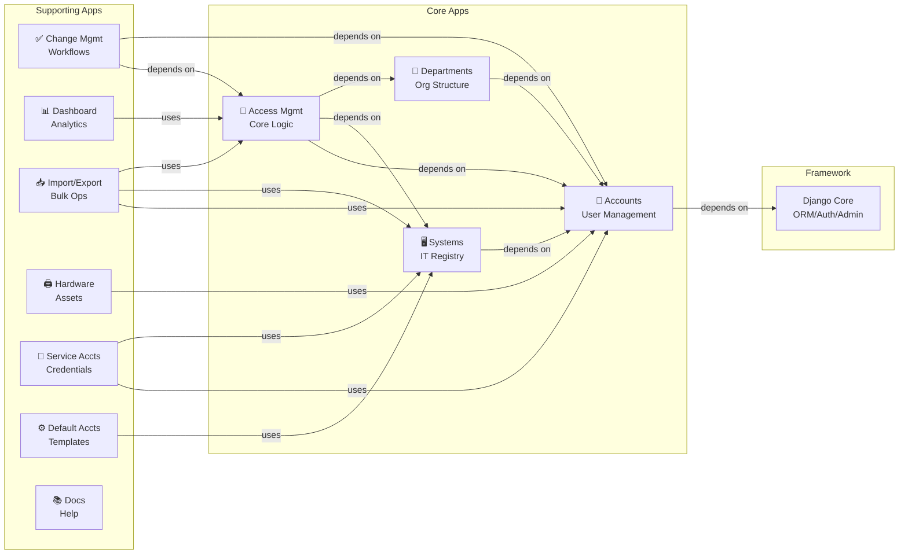

## 3. Data Model Relationships

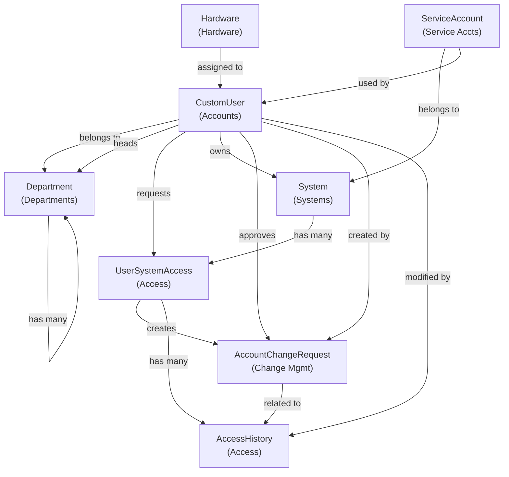

## 4. User Access Request Workflow

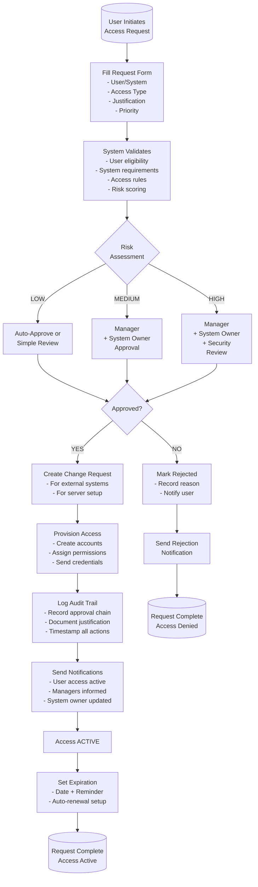

## 5. Access Renewal Workflow

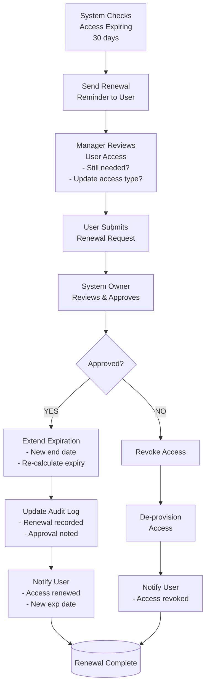

## 6. Access Revocation Workflow

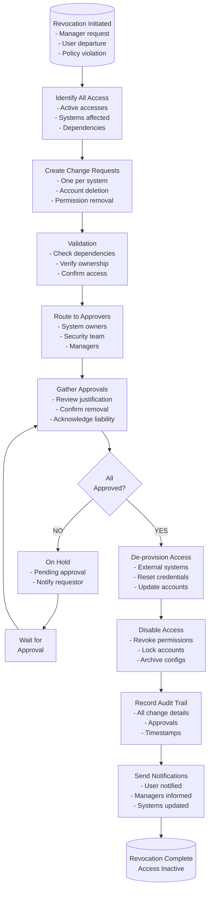

## 7. User Deletion (GDPR/Termination) Workflow

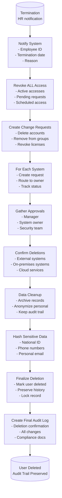

## 8. Manager Quarterly Access Review

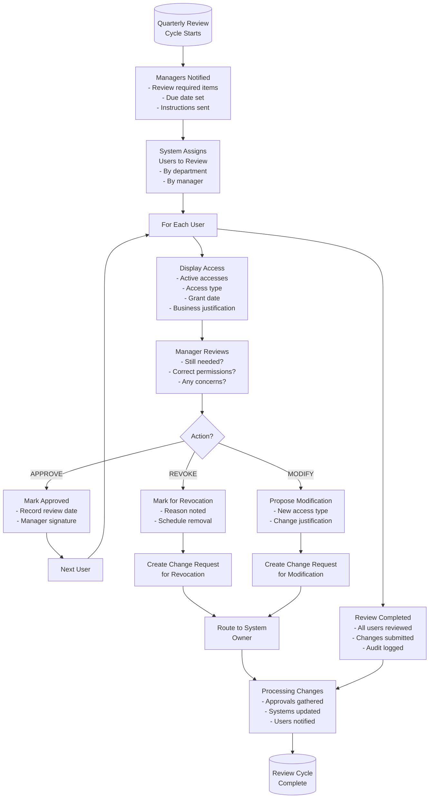

## 9. Change Request Approval Workflow

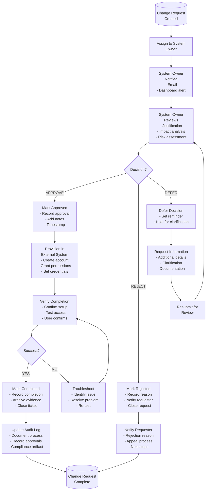

## 10. Risk-Based Request Routing

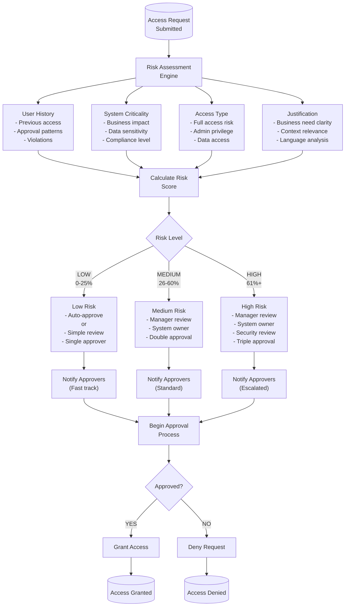

## 11. Database Schema Relationships

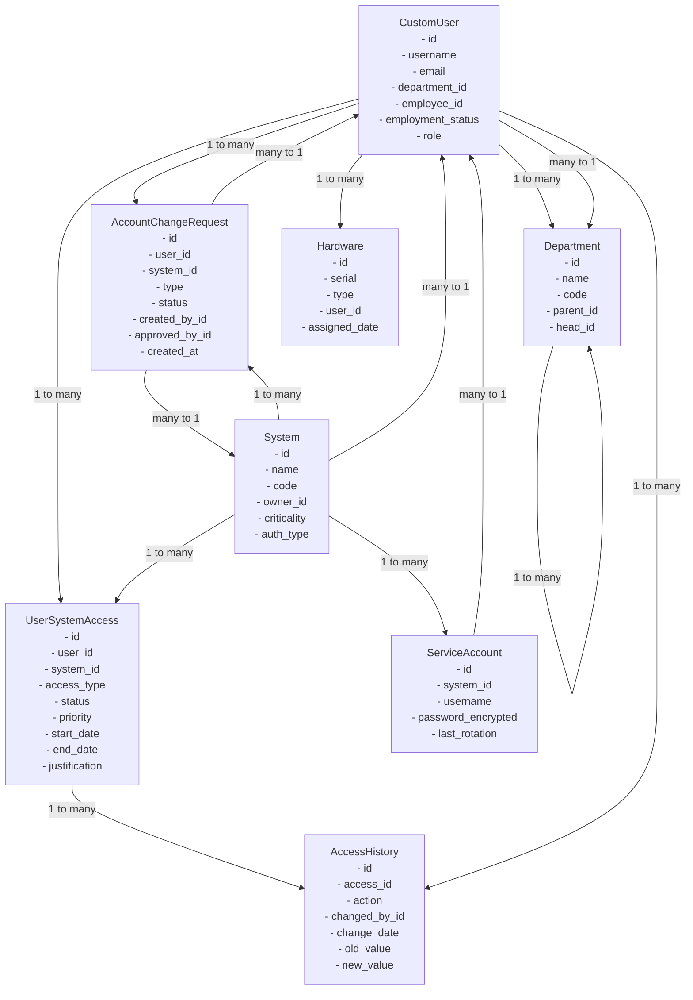

## 12. Integration Architecture

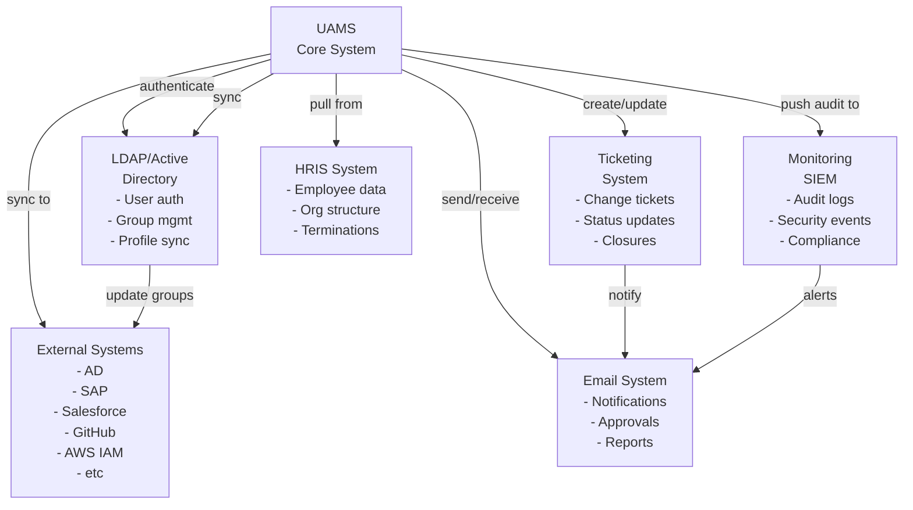

## 13. Activity Statuses & Transitions

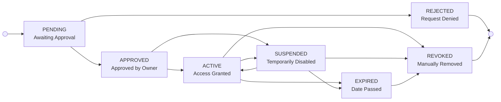

## 14. API Architecture

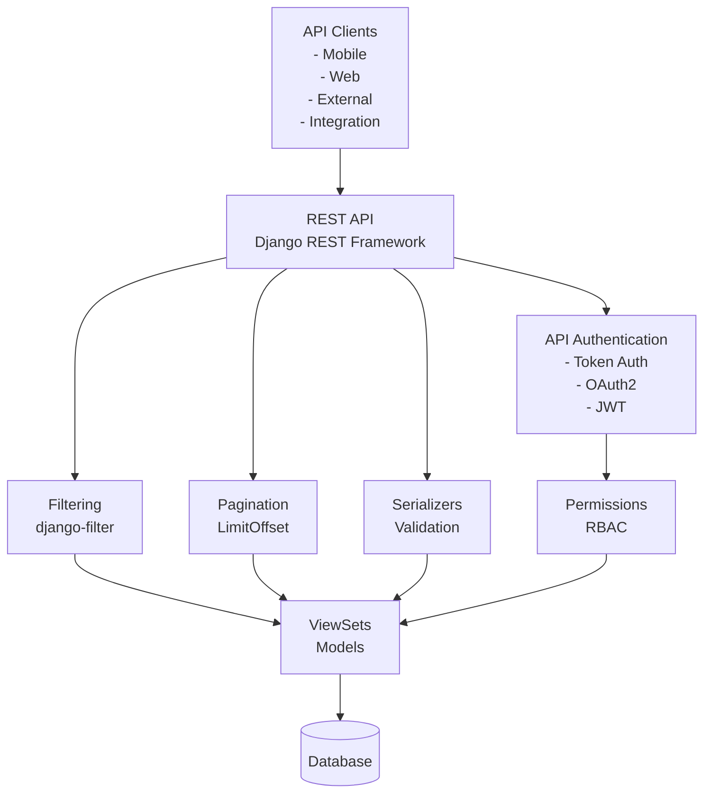

---

**End of Visual Diagrams**

All diagrams above have been created using Mermaid.js and show:
- System architecture and layering
- Module dependencies
- Data relationships
- Complete workflows
- Integration points
- Database schema
- Status transitions
- API structure

These diagrams provide a comprehensive visual representation of the UAMS architecture and workflows.
